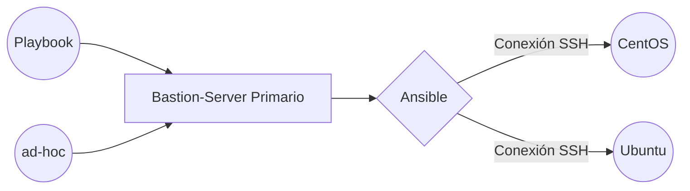

# Obligatorio de Taller Linux 2025
Este es un proyecto creado con la finalidad de poner en práctica el conocimiento adquirido en el transcurso del taller de servidores Linux.

Utilizando el conocimiento adquirido en la creación de servidores y la automatización de tareas utilizando Ansible. Aprovecharemos esta oportunidad para practirar la documentacion en Github.

# Sistemas Operativos
En este caso particular únicamente utilizaremos servidores Centos y Ubuntu.

|     SO         |           Dependencias        |     Comentarios                  |
|----------------|-------------------------------|----------------|
|CentOS          |`"ansible.posix"`              |Lo utilizaremos para manejar el firewall en CentOS.
|Ubuntu          |`"community.general"`           |Lo utilizaremos para manejar el firewall en Ubuntu.

## Diagrama Básico.

Este diagrama dará una idea básica de cómo funcionará la implementación: 

# Ejercicio 1

#### Verificación de conexión exitosa con el módulo ping de Ansible.

Captura:

# Ejercicio 2
#### Ejecución de comandos AD-HOC.
2.1. Verificar tiempo de actividad en los servidores:

2.2. Instalar apache en servidores WEB:

2.3. Verificar uso de espacio en disco de los servidores ubuntu:

# Ejercicio 3
#### Ejecución de playbooks (hardening.yml) y (webserver.yml)

Ejecución del playbook webserver.yml:

Ejecución del playbook hardening.yml:

# Reflexión sobre los desafíos encontrados
Mi mayor dificultad a la hora de realizar este trabajo fue sostener una correcta sintaxis en la creación de playbooks y inicialmente acostumbrarme a utilizar github ya que fue mi primera experiencia.

# Referencias
[Module-Posix](https://docs.ansible.com/ansible/latest/collections/ansible/posix/index.html)

[Module-Community_general_ufw](https://docs.ansible.com/ansible/latest/collections/community/general/ufw_module.html)

[Module-bultin-systemd](https://docs.ansible.com/ansible/latest/collections/ansible/builtin/systemd_service_module.html#ansible-collections-ansible-builtin-systemd-service-module)

[Module-bulit](https://docs.ansible.com/ansible/latest/collections/ansible/builtin/index.html)
